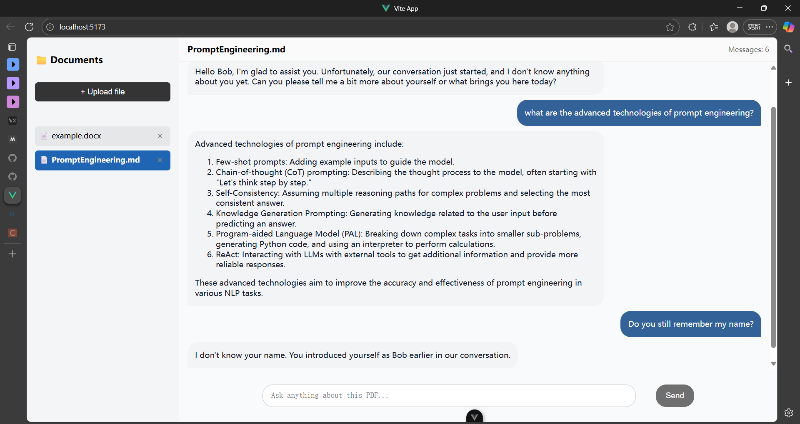
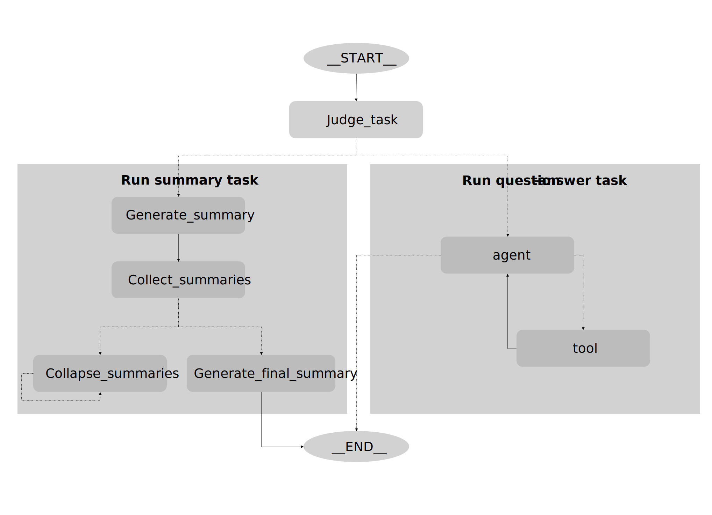

# 🤖 从零搭建基于PDF的智能问答Agent

<div align="center">


<br>
<b>基于大语言模型的智能文档问答系统，让您的PDF文档"会说话"</b>

</div>

---
## 📖 项目简介

本项目使用 `LangChain` + `LangGraph` 构建了一个基于PDF文档的智能问答Agent，并配套开发了完整的 `Vue` + `Flask` 全栈Web系统。系统具备多文档管理、智能对话、历史记录等核心功能，为用户提供高效的文档交互体验。
另外，项目整理了 `LangChain` 入门笔记，旨在帮助初学者真正从0开始学习如何设计构建一个MVP

## ✨ 核心功能



### 📄 多文档智能管理
- **独立会话隔离**：每个文档创建独立的对话会话
- **精准上下文**：问答仅基于当前文档内容，避免信息混淆

### 💬 智能多轮对话
- **记忆增强**：集成对话记忆机制，支持连贯的多轮对话
- **上下文理解**：基于文档内容的深度语义理解
- **智能推理**：利用大语言模型进行逻辑推理和答案生成

### 🗂️ 对话历史管理
- **本地持久化**：对话记录本地存储，重启不丢失
- **会话管理**：支持会话查看、续聊、删除等操作
- **数据安全**：用户数据完全本地化，保护隐私安全

## 🏗️ Agent系统架构

本系统在问答的基础上，为了解决摘要类问题文本过长的限制，针对摘要问题采用`Map-Reduce`的方法。其原理可见 [summarize_text.ipynb](./langchain/tutorial/7-summarize_text.ipynb) 




## 📁 项目结构

```
PDF-QA-Agent/
│
├── frontend/                   # Vue前端应用
│   ├── src/
│   ├── public/
│	├── package.json
│   └── ......
│
├── PersonalKnowledgeBase/     # Flask后端服务
│   ├── app.py                 # 主应用入口
│   ├── config.py              # 配置文件
│   ├── requirements.txt       # Python依赖
│   └── ......                 # Agent核心逻辑
│
├── langchain/                 # LangChain学习与实践（快速入门langchain、langgraph）
│	├── Tutorial.md            # agent开发入门知识说明文档
│	├── PromptEngineering.md   # 提示词工程技巧
│   └── tutorials/             # langchian官方项目实践
│
├── image/                     # 项目截图与素材
├── Guide-AutoDL.md            # 云服务器部署指南
└── README.md                  # 项目说明文档
```


## 🚀 快速开始

### 系统要求

- **Python**: 3.11.5
- **Node.js**: 22.11.0
- **存储**: 至少10GB可用空间

### 后端部署

#### 1. 环境准备
```bash
# 进入后端目录
cd PersonalKnowledgeBase

# 安装Python依赖
pip install -r requirements.txt
```

#### 2. 聊天模型配置

##### 方案一：API调用（推荐初学者）
1. 访问 [Google AI Studio](https://aistudio.google.com/api-keys) 获取Gemini API Key
2. 设置环境变量：
```bash
export GOOGLE_API_KEY="your-api-key-here"
```
3. 在 `config.py` 中设置 `use_model_way = "api"`

> 💡 **网络配置**：如遇网络问题，请在 `config.py` 中配置你的代理端口（如：`7890`）

##### 方案二：本地部署（推荐生产环境）
1. 安装 [Ollama](https://ollama.com/)并设置环境变量
2. 下载支持工具调用的模型：
```bash
ollama pull llama3.2
```
> 如果希望性能更好一些，请使用更大的模型。注意，所选模型需要支持`tool-calling` 
> 
> 如果使用此方案，请在系统运行时确保ollama服务开启：
> ```
> ollama serve
> ```

#### 3. 嵌入模型配置

1. `cd`到嵌入模型保存文件夹下，并执行以下指令
```bash
huggingface-cli download sentence-transformers/all-mpnet-base-v2 --local-dir ./ --local-dir-use-symlinks False
```
2. 修改`config.py`中的嵌入模型文件地址

> 除了`huggingface`上的嵌入模型，可以使用 `gemini` 的嵌入模型，详情见官方文档。

#### 4. LangSmith监控agent行为（可选）

1. 在[LangSmith](https://www.langchain.com/langsmith)官网注册账号并申请一个`api`
2. 配置系统环境变量，并修改 `config.py` 文件中的 `os.environ['LANGSMITH_TRACING'] = 'False'`为`'True'`
```bash
export LANGSMITH_API_KEY="your-api-key-here"
export LANGSMITH_PROJECT="default"  # 或者是其它
```

>💡 **网络配置**：使用Langsmith进行监控需要vpn，如果既使用LangSmith又使用Ollama本地部署，请将代理设置为“规则模式”

#### 5. 启动后端服务
```bash
python app.py
```
✅ **启动成功提示**：
```
* Running on http://127.0.0.1:5000
```


### 前端部署

#### 1. 环境检查
确保已安装 Node.js 和 npm：
```bash
node --version
npm --version
```

#### 2. 安装依赖并启动
```bash
cd frontend
npm install
npm run dev
```

✅ **启动成功提示**：
```
VITE v7.1.9  ready in 1359 ms

  ➜  Local:   http://localhost:5173/
  ➜  Network: use --host to expose
```

访问 `http://localhost:5173/` 即可开始使用系统！


## 🔮 未来规划

- [ ] **数据库升级**：使用专业数据库替代浏览器缓存
- [x] **多文档支持**：增加支持文档的类型，如doc、markdown等
- [ ] **流式输出**：让模型回答流式输出，提升用户体验
- [ ] **多文档分析**：实现跨文档对比和关联分析
- [ ] **智能索引**：构建文档内容索引，提升检索效率
- [ ] **文档分类**：自动分类文档并提供引导式提问
- [ ] **GPU加速**：完善AutoDL云服务器部署指南
- [ ] **视频教程**：录制详细的使用和开发教程
- [ ] **提示词工程**：迭代优化提示词，提高模型表现

## 🛠️ 技术栈

**后端技术**
- `Flask` - Python Web框架
- `LangChain` - LLM应用开发框架
- `LangGraph` - 多步骤工作流管理
- `ChromaDB` - 向量数据库
- `PyPDF2` - PDF文档解析

**前端技术**
- `Vue 3` - 渐进式JavaScript框架
- `Vite` - 前端构建工具

**AI模型**
- `Gemini API` - Google大语言模型
- `Ollama` - 本地模型管理
- `sentence-transformers` - 文本嵌入模型

## 🤝 贡献指南

欢迎各种形式的贡献！

1. **报告问题**：在GitHub Issues中提交bug报告或功能请求
2. **代码贡献**：提交Pull Request改进代码
3. **文档完善**：帮助改进文档和教程
4. **功能建议**：分享您的使用场景和需求

---

<div align="center">

⭐ 如果这个项目对您有帮助，请给出一个Star！
<br>
<b>用AI赋能知识管理，让智能触手可及</b> ✨

</div>