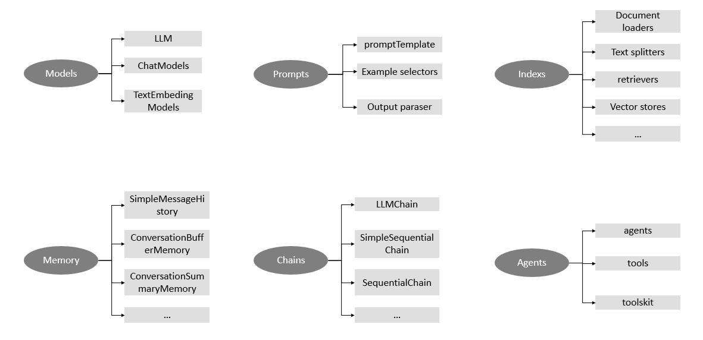

## 一、前言

#### 1. 什么是LangChain

Langchain是一个用于开发由语言模型驱动的应用程序的框架。

最强大和差异化的应用程序不仅会通过 API 调用语言模型，而且还会：
 - 数据感知：将LLM连接到其它数据源
 - 代理性：允许LLM与其环境交互

LangChain框架的设计考虑到上述两个原则
> 🔗 [欢迎来到 LangChain — 🦜🔗 LangChain 0.0.149](https://lagnchain.readthedocs.io/en/stable/index.html)
> 🔗 [介绍 |🦜️🔗 LangChain](https://python.langchain.com/docs/introduction/)

#### 2. LangChain最常用的核心功能
1) 记事儿：让 LLM “不健忘”（Memory 功能）
2)  查资料：让 LLM “懂专业”（Retrieval 功能）
3) 串流程：让 LLM “按步骤做事”（Chains 功能）
4) 用工具：让 LLM “能干活”（Agents 功能）

> 🔗 [LangChain 入门：从 0 到 1 搞懂 LLM 应用开发框架​ - duanxz - 博客园](https://www.cnblogs.com/duanxz/p/19100356)

#### 3. LangChain的六大核心模块

Models、Prompts、Indexs、Memory、Chains、Agents

**代码演示及文档导航**：[langchain-tutorials/LangChain Cookbook Part 1 - Fundamentals.ipynb](https://github.com/gkamradt/langchain-tutorials/blob/main/LangChain%20Cookbook%20Part%201%20-%20Fundamentals.ipynb)

## 二、实践

项目整理了 `langchain` 官方文档中的8个快速入门代码示例
> 其中（第8个）基于图数据的问答将在未来完善

每个`ipynb`提供了参考来源、解释说明等，并针对官方文档代码中的不 work 的部分进行了适当的修改。
